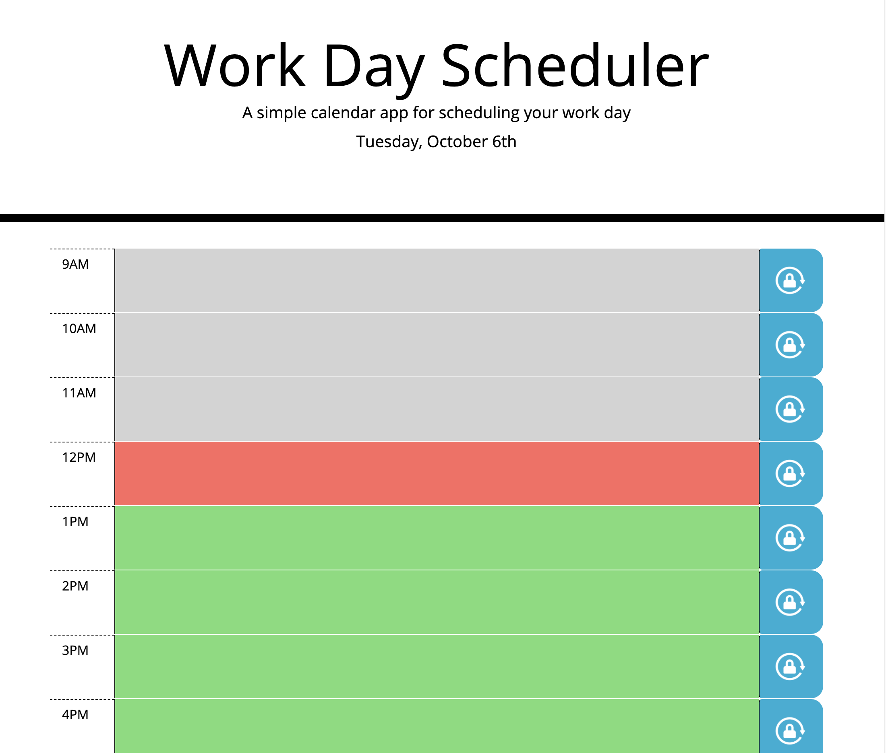

# Work Day Scheduler

Time management is a keystone component to any successful business day. Having an organized schedule allows you to focus on what needs to get done. The work day scheduler web app allows you to keep track of your daily tasks so you can stay on top of things.

Work Day Scheduler is powered by Jquery to dynamically generate html elements. The goal for this project was to minimize the use of static html. The reduction of html in favor of Jquery reduces code repetition which allows for changes to be easily implemented. On the other hand, this approach introduces dependencies and less readable code.

## Features

* Current Date
* Persistent time block inputs through the use of save button
* Time block color coding
    * gray indicates the time block has passed
    * red indicates the present time block
    * green indicates the time block is in the future

## Usage

View the deployed [Work Day Scheduler!](https://roccomaniscalco.github.io/work-day-scheduler/)

* Click a time block to edit its text content
* Click the adjacent lock icon button to save a time block's text

## Installation

1.  Visit the [work-day repository](https://github.com/roccomaniscalco/work-day-scheduler)
2.  Click the green code button and select method of download
3.  Open the downloaded repository with your choice of IDE

## Credits

* Starting html and css files provided by [Jonathon Watson](https://github.com/jonathanjwatson)
* CSS styling components provided by [Bootstrap](https://getbootstrap.com/)
* Lock icon created with [Icon Scout](https://iconscout.com/)
* [Jquery](https://jquery.com/) API
* [Moment.js](https://momentjs.com/) API

## License

Work Day Scheduler license

Copyright (c) 2020 Rocco Maniscalco

Permission is hereby granted, free of charge, to any person obtaining a copy
of this software and associated documentation files (the "Software"), to deal
in the Software without restriction, including without limitation the rights
to use, copy, modify, merge, publish, distribute, sublicense, and/or sell
copies of the Software, and to permit persons to whom the Software is
furnished to do so, subject to the following conditions:

The above copyright notice and this permission notice shall be included in all
copies or substantial portions of the Software.

THE SOFTWARE IS PROVIDED "AS IS", WITHOUT WARRANTY OF ANY KIND, EXPRESS OR
IMPLIED, INCLUDING BUT NOT LIMITED TO THE WARRANTIES OF MERCHANTABILITY,
FITNESS FOR A PARTICULAR PURPOSE AND NONINFRINGEMENT. IN NO EVENT SHALL THE
AUTHORS OR COPYRIGHT HOLDERS BE LIABLE FOR ANY CLAIM, DAMAGES OR OTHER
LIABILITY, WHETHER IN AN ACTION OF CONTRACT, TORT OR OTHERWISE, ARISING FROM,
OUT OF OR IN CONNECTION WITH THE SOFTWARE OR THE USE OR OTHER DEALINGS IN THE
SOFTWARE.